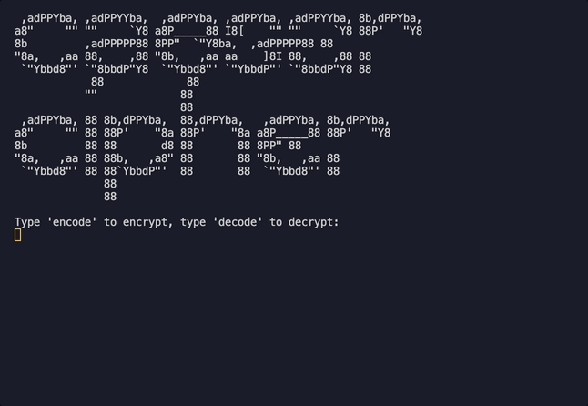

This is a program that takes a piece of text and encodes the it by shifting the alphabet by a user-selected amount. The program can then decode the encoded message again by taking the encoded message and the shift amount as inputs.

